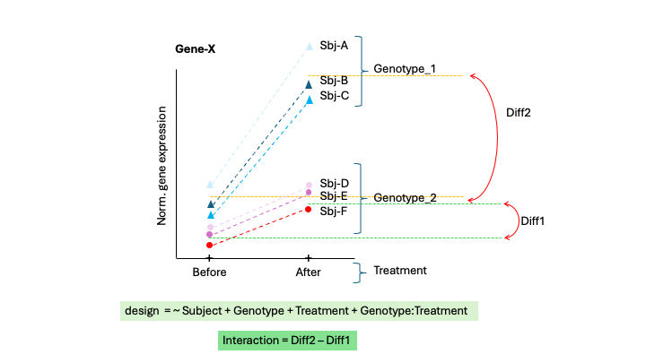
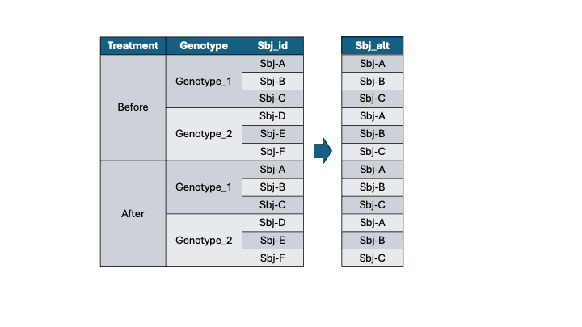

# A. Load libraries

Load required R packages

```{r}

```

# B. Load read counts table

```{r}
# Load raw read counts

```

# C. Load metadata

```{r}
# 1.Load metadata and clean sample_ids


# 2. Ensure samples on read-counts table columns match order of samples in metadata table rows

# 3. Include total read counts in metadata

# 4. Convert categorical variables to factors

# 5. Summarize metadata table

```

# D. Clean gene expression data

## 1. Filter genes based on read counts per sample

```{r}
# Print out dimension of the counts.raw dataframe 


# Filter genes based on minimum number of reads per sample and the minimum group size

# Print out dimension of the counts.fil dataframe


```

# E. Generate DESeq object

```{r message=FALSE, warning=FALSE}
# 1. Create DESeq object


# 2. Estimate library size and read counts dispersion


```

# F. Exploratory analysis

## 1. Principal component analysis

```{r}
# 1. variance stabilizing transformation of counts (optinally you can use log transformation with rlog)


# 2. Generate PCA plot


```

# G. Run differential expression

We will contrast *`After`* vs *`Before`* factors of the *`Treatment`* variable, controlling by subject (paired experimental design).

```{r message=FALSE, warning=FALSE}
# 1. Add design formula: After vs Before, within subjects


# 2. Recompute dispersions


# 3. Print out coeficients


# 4. Get DE results ------------------------------------------------

# 4.2 Method 2: Using coeficients


```

Next, we will contrast *`After`* vs *`Before`* factors of the *`Treatment`* variable, but this time `without` controlling by subject.

```{r message=FALSE, warning=FALSE}
# 1. Add design formula: After vs Before, within subjects


# 2. Recompute dispersions


# 3. Print out coeficients


# 4. Get DE results ------------------------------------------------

# 4.2 Method 2: Using coeficients


```

**Note:** Usually, sensitivity drops when a paired experiment is analyzed unpaired.

# H. Looking at the effect of the genotype on how genes respond to treatment: Interactions

Now the main effect (what we are interested in) is the interaction term (Genotype:Treatment), that has to be at the end of the design formula.

The second most important effect is the Treatment (Before/After) that will be the X axis, followed by the Genotype and the Subj_id:



Note the **nested** design:



```{r}
# 1. Add design formula: After vs Before, within subjects
#   Now the main effect is the interaction term (Genotype:Treatment) 
#   that has to be at the end of the design formula.


# 2. Recompute dispersions


# 3. Print out coefficients


# 4. Get DE results ------------------------------------------------

# 4.2 Method 2: Using coefficients


```

Plot an example of a deferentially expressed gene with a significant interaction.

```{r}
# Plot an example of interaction for gene "ENSG00000213553"

```

**Question 2: What genes are differentially expressed in Genotype \`Geno_1\`?**

```{r message=FALSE, warning=FALSE}
# 1. Print out coeficients


# 2. Get DE results for genes are diferentially expressed across Treatments in Genotype Geno_1


```

```{r}
# Plot an example of interaction for gene "ENSG00000277145"


```

**Question 3: What genes are differentially expressed across Treatment in Genotype \`Geno_2\`?**

```{r message=FALSE, warning=FALSE}
# 1. Print out coeficients


# 2. Get DE results for genes are diferentially expressed across Treatment in Genotype Geno_2


```

```{r}
# Plot an example of interaction fro gene "ENSG00000092847"

```
