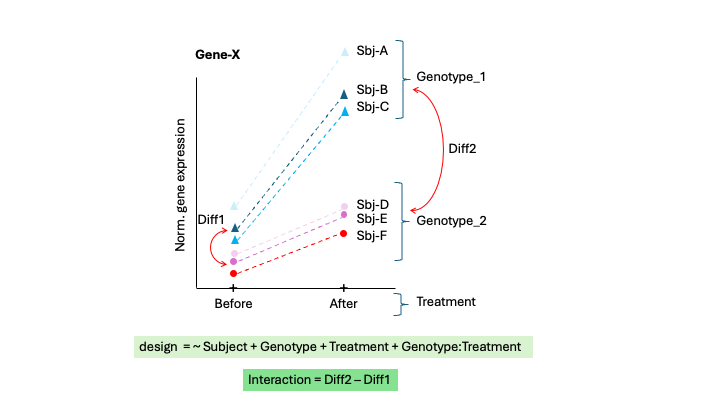
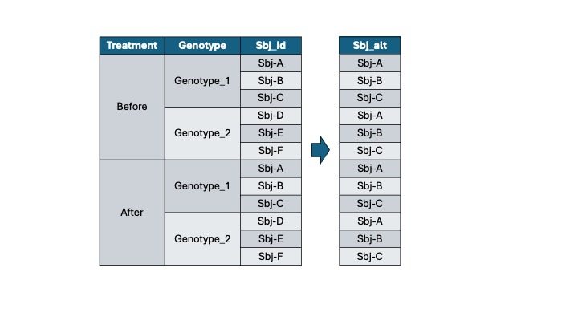

# Guide 2: Paired DE analysis and interaction

## Two treatment levels (Before and After) with two genotypes (Geno_1 and Geno_2). Experimental design = paired.


In Rstudio open the **Guide_2.Rmd notebook template** in Rstudio:

In Rstudio go to `File > Open File` and select the file `Guide_2.Rmd`.

# A. Load libraries

Load required R packages

```{r Step_1, message=FALSE, warning=FALSE}

pacman::p_load(BiocManager, DESeq2, readxl, tidyverse, pheatmap, ashr)
```

# B. Load read counts table

```{r}
# Load raw read counts
counts.raw <- read.delim(file = "data/counts_ex1_2t.txt", 
                         header = T, sep = "\t",row.names = 1)

counts.raw
```

# C. Load metadata

```{r}
# 1. Load metadata and clean sample_ids
metadata <- read.delim(file = "data/meta_ex1_2t.txt", 
                         header = T, sep = "\t",row.names = 1)

# 2. Ensure samples on read-counts table columns match order of samples in metadata table rows
counts.raw <- select(counts.raw, rownames(metadata))


# 3. Include total read counts in metadata
metadata$read_counts <- colSums(counts.raw, na.rm = TRUE)

metadata

# 4. Convert categorical variables to factors
metadata$Genotype <- factor(metadata$Genotype)
metadata$Sbj_id <- factor(metadata$Sbj_id)
metadata$Treatment <- factor(metadata$Treatment, levels = c("Before","After"))
metadata$Sbj_alt <- factor(metadata$Sbj_alt)

# 5. Summarize metadata table
summary(metadata)

```

# D. Clean gene expression data

## 1. Filter genes based on read counts per sample

```{r}
# Print out dimension of the counts.raw dataframe 
dim(counts.raw)

# Filter genes based on minimum number of reads per sample and the minimum group size
keep <- rowCounts(counts.raw > 10) > 4
counts.fil <- counts.raw[keep,]

# Print out dimension of the counts.fil dataframe
dim(counts.fil)
```

# E. Generate DESeq object

```{r message=FALSE, warning=FALSE}
dds <- DESeqDataSetFromMatrix(countData = counts.fil,
                              colData = metadata,
                              design = ~1) 

dds <- DESeq(dds)
```

# F. Exploratory analysis

## 1. Principal component analysis

```{r}
# 1. variance stabilizing transformation of counts (optinally you can use log transformation with rlog)
dds.vst <- vst(dds, blind=TRUE)

DESeq2::plotPCA(dds.vst, 
              intgroup = c("Treatment"),
              ntop = 500,
              returnData = FALSE,
              pcsToUse = 1:2) 


```

# G. Run differential expression

We will contrast *`After`* vs *`Before`* factors of the *`Treatment`* variable, controlling by subject (paired experimental design).

```{r message=FALSE, warning=FALSE}
# 1. Add design formula: After vs Before, within subjects
design(dds) <- ~Sbj_id + Treatment 

# 2. Recompute dispersions
dds <- DESeq(dds)

# 3. Print out coeficients
resultsNames(dds)

# 4. Get DE results ------------------------------------------------

# 4.2 Method 2: Using coeficients
res.2 <- lfcShrink(dds, contrast=list("Treatment_After_vs_Before"), type = "ashr")

summary(res.2, alpha=0.05)
```

Next, we will contrast *`After`* vs *`Before`* factors of the *`Treatment`* variable, but this time without controlling by subject.

```{r message=FALSE, warning=FALSE}
# 1. Add design formula: After vs Before, within subjects
design(dds) <- ~Treatment 

# 2. Recompute dispersions
dds <- DESeq(dds)

# 3. Print out coeficients
resultsNames(dds)

# 4. Get DE results ------------------------------------------------

# 4.2 Method 2: Using coeficients
res.3 <- lfcShrink(dds, contrast=list("Treatment_After_vs_Before"), type = "ashr")

summary(res.3, alpha=0.05)
```

**Note:** Usually, sensitivity drops when a paired experiment is analyzed unpaired.

# H. Impact of genotype on the gene response to treatment: Interactions

Now the main effect (what we are interested in) is the interaction term (Genotype:Treatment), that has to be at the end of the design formula.

The second most important effect is the Treatment (Before/After) that will be the X axis, followed by the Genotype and the Subj_id:



Note the **nested** design:



```{r}
# 1. Add design formula: After vs Before, within subjects
#   Now the main effect is the interaction term (Genotype:Treatment) 
#   that has to be at the end of the design formula.

design(dds) <- ~ Sbj_alt + Genotype + Treatment + Genotype:Treatment 

# 2. Recompute dispersions
dds <- DESeq(dds)

# 3. Print out coeficients
resultsNames(dds)

# 4. Get DE results ------------------------------------------------

# 4.2 Method 2: Using coeficients
res.inte <- results(dds, contrast=list("GenotypeGeno_2.TreatmentAfter"))

summary(res.inte, alpha=0.05)
```

Plot an example of a deferentially expressed gene with a significant interaction.

```{r}
# Plot an example of interaction
gene <- "ENSG00000213553"
plotCounts(dds = dds, 
               gene = gene,
               intgroup = c("Treatment"), 
               returnData = FALSE,
               col=c("red","blue")[dds@colData$Genotype])
```

**Question 2: What genes are differentially expressed in Genotype `Geno_1`?**

```{r message=FALSE, warning=FALSE}
# 1. Print out coeficients
resultsNames(dds)

# 2. Get DE results for genes are diferentially expressed across Treatments in Genotype Geno_1
res.geno_1.coef <- lfcShrink(dds, contrast=list("Treatment_After_vs_Before"), type = "ashr")

summary(res.geno_1, alpha=0.05)
```

```{r}
# Plot an example of interaction
gene <- "ENSG00000277145"
plotCounts(dds = dds, 
               gene = gene,
               intgroup = c("Treatment"), 
               returnData = FALSE,
               col=c("red","blue")[dds@colData$Genotype])
```

**Question 3: What genes are differentially expressed across Treatment in Genotype `Geno_2`?**

```{r message=FALSE, warning=FALSE}
# 1. Print out coeficients
resultsNames(dds)

# 2. Get DE results for genes are deferentially expressed across Treatment in Genotype Geno_2
res.geno_2 <- lfcShrink(dds, contrast=list("Treatment_After_vs_Before", "GenotypeGeno_2.TreatmentAfter"), type = "ashr")

summary(res.geno_2, alpha=0.05)

```

```{r}
# Plot an example of interaction
gene <- "ENSG00000092847"
plotCounts(dds = dds, 
               gene = gene,
               intgroup = c("Treatment"), 
               returnData = FALSE,
               col=c("red","blue")[dds@colData$Genotype])
```
