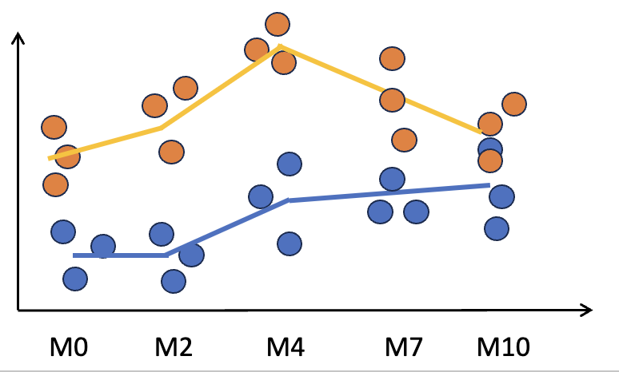

# Experimental design:

{width="500"}

# A. Load libraries

Load required R packages

```{r Step_1, message=FALSE, warning=FALSE}

pacman::p_load(BiocManager, DESeq2, tidyverse, pheatmap, ashr, DEGreport)
```

# B. Load read counts table

```{r}
# Load raw read counts
counts.raw <- read.delim(file = "data/counts_ex2_2t.txt", 
                         header = T, sep = "\t",row.names = 1)

counts.raw
```

# C. Load metadata

```{r}

# Load metadata and clean sample_ids
metadata <- read.delim(file = "data/meta_ex2_2t.txt", 
                         header = T, sep = "\t",row.names = 1)

# Check metadata row names == counts column names
same_order <- all(rownames(metadata) == colnames(counts.raw))

# Sort counts columns to match order in metadata rows
if(!same_order){
  print("Sorting columns in counts.all")
  counts.raw <- select(counts.raw, rownames(metadata))
}

# Include total read counts in metadata
metadata$read_counts <- colSums(counts.raw, na.rm = TRUE)

metadata

# Convert categorical variables to factors
metadata$Treatment <- factor(metadata$Treatment)
metadata$Sbj_id <- factor(metadata$Sbj_id)
metadata$Sbj_alt <- factor(metadata$Sbj_alt)
metadata$Time_id <- factor(x = metadata$Time_id, 
                           levels = c("M0","M2","M4","M7","M10","M13"))

summary(metadata)

```

# D. Clean gene expression data

## 1. Filter genes based on read counts per sample

```{r}

dim(counts.raw)
keep <- rowCounts(counts.raw > 10) > 4
counts.fil <- counts.raw[keep,]
dim(counts.fil)
```

# E. Generate DESeq object

```{r message=FALSE, warning=FALSE}
dds <- DESeqDataSetFromMatrix(countData = counts.fil,
                              colData = metadata,
                              design = ~1) 

dds <- DESeq(dds)
```

# F. Exploratory analysis

## 1. Principal component analysis

```{r}
# 1. variance stabilizing transformation of counts (optinally you can use log transformation with rlog)
dds.vst <- vst(dds, blind=TRUE)

# Method 1: ---------------------------------
# easy

DESeq2::plotPCA(dds.vst, 
              intgroup = c("Time_id"),
              ntop = 500,
              returnData = FALSE,
              pcsToUse = 1:2) 

# Method 2: : ---------------------------------
# more customizable

# 1. Compute PCA 
pca <- prcomp(t(assay(dds.vst)))

# 2. Compute contribution of each component to the total variance
percentVar <- pca$sdev^2 / sum( pca$sdev^2)
pc1 <- round(percentVar*100, digits = 1)[1]
pc2 <- round(percentVar*100, digits = 1)[2]

# 3. assembly the data for the plot
pca.df <- data.frame(PC1=pca$x[,"PC1"], 
                   PC2=pca$x[,"PC2"], 
                   Time_id=dds.vst@colData$Time_id,
                   Subject_id=dds.vst@colData$Sbj_id,
                   Treatment=dds.vst@colData$Treatment
                   )

# 4. Generate plot
pca.p <- ggplot(data=pca.df, aes(x=PC1, y=PC2, color=Time_id, shape=Treatment)) + 
    geom_point(size=3) + 
    xlab(paste0("PC1:",pc1,"% variance")) + 
    ylab(paste0("PC2:",pc2,"% variance")) 

# 5. Save PCA plot
ggsave(filename = "pca.pdf", plot = pca.p)

pca.p

```

# G. Run differential expression with LRT

We will analyze the impact of Drug A and B overtime. There are two possible approaches:

A.  A pairwise comparisons between each time point and the baseline (M0). A kind of two-sample t-test comparisons.

B.  A Likelihood Radio Test approach (LRT), where you look at genes that are differentially expressed in at least one time point. A kind of anova test.

The LRT is comparing the full model to the reduced model to identify significant genes. **The p-values are determined solely by the difference in deviance between the ‘full’ and ‘reduced’ model formula (not log2 fold changes)**. Essentially the LRT test is testing whether the term(s) removed in the ‘reduced’ model explains a significant amount of variation in the data?

Generally, this test will result in a larger number of genes than the individual pair-wise comparisons. While the LRT is a test of significance for differences of any level of the factor, one should not expect it to be exactly equal to the union of sets of genes using Wald tests (although we do expect a majority overlap).

## a) What genes change over time, independently of treatment?

Here the main effect is `Time_id`.

Because samples are paired, we need to control for subjects with `Sbj_id`

```{r message=FALSE, warning=FALSE}

# 1. Likelihood Ratio Test (LRT) ---------------------------------------

# 1.a Add design formula: After vs Before, within subjects
design(dds) <- ~Sbj_id + Time_id 

# 1.b Recompute dispersions
dds.lrt <- DESeq(dds, test = "LRT", reduced = ~Sbj_id)


# 1.c Get results
res.lrt <- results(object = dds.lrt)

# 1.d summarize results
summary(res.lrt, alpha=0.0001)


```

```{r}

# Plot DE gene example
gene <- "ENSG00000227232"
plotCounts(dds = dds.lrt, 
               gene = gene,
               intgroup = c("Time_id"), 
               returnData = FALSE,
               col=dds.lrt@colData$Treatment)
  


```

## b) What genes change differently over time, across treatments?

Here, the main effect is the interaction between `Treatment` and `Time_id`.

Along time, we want to compare samples within Treatments and within each treatment, within subjects.

```{r message=FALSE, warning=FALSE}

# 2. Likelihood Ratio Test (LRT) ---------------------------------------

# 2.a Add design formula: After vs Before, within subjects
design(dds) <- ~ Sbj_alt + Treatment + Time_id + Treatment:Time_id

# 2.b Recompute dispersions
dds.inter.lrt <- DESeq(dds, test = "LRT", reduced = ~ Sbj_alt + Treatment + Time_id )

# 2.c Get results
res.inter.lrt <- results(object = dds.inter.lrt)

# 2.d summarize results
summary(res.inter.lrt, alpha=0.0001)

```

Gene examples:

```{r}

# Plot DE gene example 1
gene <- "ENSG00000008130"
plotCounts(dds = dds.inter.lrt, 
               gene = gene,
               intgroup = c("Time_id"), 
               returnData = FALSE,
               col=dds.inter.lrt@colData$Treatment)

# Plot DE gene example 2
gene2 <- "ENSG00000078369"
plotCounts(dds = dds.inter.lrt, 
               gene = gene2,
               intgroup = c("Time_id"), 
               returnData = FALSE,
               col=dds.inter.lrt@colData$Treatment)

```

# H. Find gene clusters

```{r message=FALSE, warning=FALSE}
# Fetch significant gene ids
res.inter.lrt.sig.ids <- rownames(subset(res.inter.lrt, padj <= 0.0001))

# Subset dds.vst to contain significant genes only and split by Treatment
dds.inter.lrt.sig.vst <- dds.vst[res.inter.lrt.sig.ids,]

# Identify gene clusters across time points
clusters_lrt <- degPatterns(ma = as.data.frame(assay(dds.inter.lrt.sig.vst)), 
                            metadata = dds.inter.lrt.sig.vst@colData, 
                            time = "Time_id", col="Treatment")

```

```{r}

# Extract genes ids from cluster 3
cluster_3.ids <- clusters_lrt$df %>% subset(cluster == 3) %>% rownames()
length(cluster_3.ids)
```
